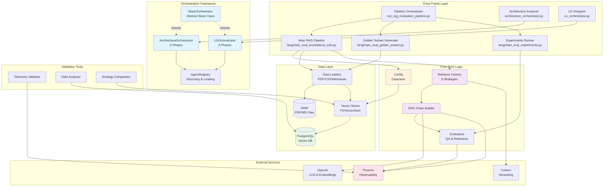
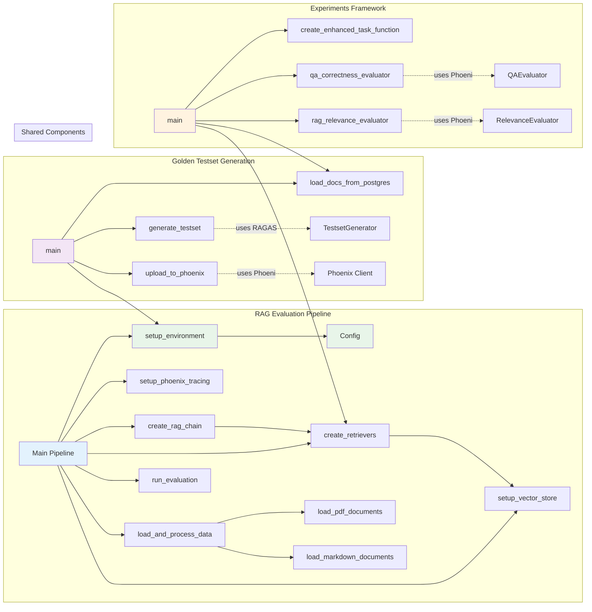
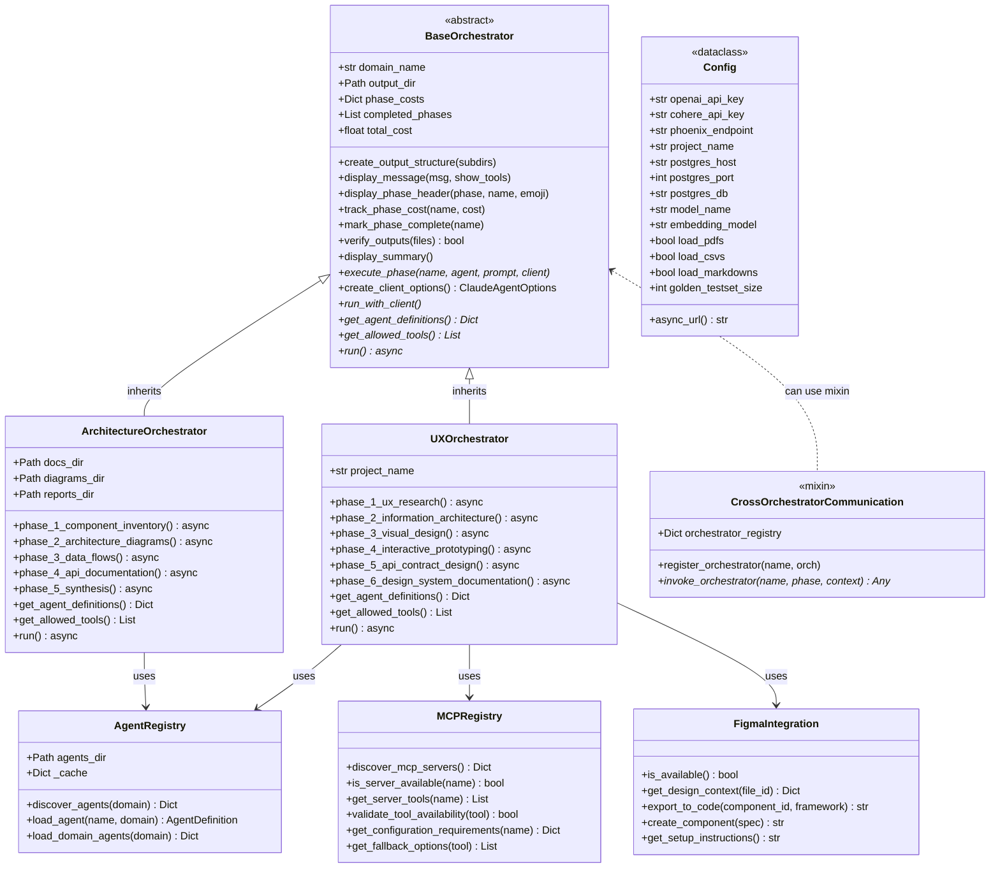

# Architecture Diagrams

**Project:** lila-research - RAG Evaluation Framework
**Analysis Date:** 2025-10-03
**Architecture Pattern:** Multi-Domain Framework with Layered Design

## System Architecture



### Architecture Explanation

The system follows a **layered architecture** with clear separation of concerns:

**Layer 1 - Entry Points:** Multiple executable scripts serve different use cases:
- **RAG Pipeline** (`langchain_eval_foundations_e2e.py`): Core evaluation workflow
- **Golden Testset** (`langchain_eval_golden_testset.py`): RAGAS-based test generation
- **Experiments** (`langchain_eval_experiments.py`): Phoenix experiment orchestration
- **Orchestrators** (`architecture_orchestrator.py`, `ux_orchestrator.py`): Multi-domain analysis

**Layer 2 - Orchestration Framework:** Portable framework (`ra_` prefix) for repository analysis:
- `BaseOrchestrator`: Abstract base class providing phase management, cost tracking, output verification
- Domain-specific orchestrators inherit and implement 5-6 phase workflows
- `AgentRegistry`: Discovers and loads agent definitions from JSON files

**Layer 3 - Core RAG Logic:** Retrieval-Augmented Generation evaluation:
- `Config`: Centralized configuration dataclass
- **6 Retrieval Strategies**: Naive, Semantic, BM25, Compression (Cohere), MultiQuery, Ensemble
- **RAG Chain Builder**: Creates LangChain pipelines with Phoenix tracing
- **Evaluators**: QA correctness and RAG relevance metrics

**Layer 4 - Data Layer:** Document loading and vector storage:
- Multi-format loaders (PDF via PyPDF, Markdown with H2 header splitting, CSV)
- PostgreSQL vector stores (baseline + semantic chunking)
- Async operations for performance

**Layer 5 - External Services:** Third-party integrations:
- **Phoenix**: LLM observability and tracing at `localhost:6006`
- **OpenAI**: GPT-4 models and text embeddings
- **Cohere**: Reranking for compression retriever

**Layer 6 - Validation Tools:** Analysis and debugging utilities

## Component Relationships



### Component Relationship Explanation

The diagram shows how the three main execution paths share common infrastructure:

**RAG Evaluation Pipeline** (Blue):
- Entry: `/home/donbr/lila-graph/lila-research/src/langchain_eval_foundations_e2e.py:390`
- Creates environment, loads documents (PDF/Markdown/CSV), sets up vector stores
- Builds 6 retrieval strategies and RAG chains
- Runs evaluation and logs results to Phoenix

**Golden Testset Generation** (Purple):
- Entry: `/home/donbr/lila-graph/lila-research/src/langchain_eval_golden_testset.py:130`
- Loads documents from PostgreSQL (populated by main pipeline)
- Uses RAGAS `TestsetGenerator` to create synthetic Q&A pairs
- Uploads dataset to Phoenix for experiments

**Experiments Framework** (Orange):
- Entry: `/home/donbr/lila-graph/lila-research/src/langchain_eval_experiments.py:113`
- Loads golden testset from Phoenix
- Runs experiments across all 6 strategies
- Evaluates with QA correctness and RAG relevance metrics

**Shared Components** (Green):
- `Config`: Centralized configuration with API keys, DB settings, model parameters
- `setup_environment()`: Loads `.env` and initializes configuration
- `load_docs_from_postgres()`: Reusable document loader
- `create_retrievers()`: Factory pattern for 6 retrieval strategies
- `setup_vector_store()`: Async vector store initialization

**Key Integration Points:**
1. Main pipeline populates PostgreSQL → Golden testset reads from DB
2. Golden testset uploads to Phoenix → Experiments read from Phoenix
3. All three use same Config, retrievers, and vector stores
4. Phoenix tracing captures all LLM interactions across components

## Class Hierarchies



### Class Hierarchy Explanation

**Orchestrator Framework Hierarchy:**

1. **BaseOrchestrator** (`/home/donbr/lila-graph/lila-research/ra_orchestrators/base_orchestrator.py:30-309`)
   - **Purpose**: Abstract base class for all domain-specific orchestrators
   - **Pattern**: Template Method pattern - defines workflow skeleton, subclasses fill in phases
   - **Key Responsibilities**:
     - Phase execution and lifecycle management
     - Cost tracking per phase and total
     - Output directory structure with timestamps (`ra_output/{domain}_{YYYYMMDD_HHMMSS}/`)
     - Progress visualization with tool usage display
     - Output verification and checkpointing
   - **Abstract Methods** (must be implemented):
     - `get_agent_definitions()`: Return agent configurations
     - `get_allowed_tools()`: Return permitted tool list
     - `run()`: Execute domain-specific workflow

2. **ArchitectureOrchestrator** (`/home/donbr/lila-graph/lila-research/ra_orchestrators/architecture_orchestrator.py:20-305`)
   - **Inherits**: BaseOrchestrator
   - **Purpose**: 5-phase repository architecture analysis
   - **Phases**:
     1. Component Inventory → `docs/01_component_inventory.md`
     2. Architecture Diagrams → `diagrams/02_architecture_diagrams.md`
     3. Data Flows → `docs/03_data_flows.md`
     4. API Documentation → `docs/04_api_reference.md`
     5. Final Synthesis → `README.md`
   - **Agents**: `analyzer` (Mermaid diagrams, code analysis), `doc-writer` (technical docs)

3. **UXOrchestrator** (`/home/donbr/lila-graph/lila-research/ra_orchestrators/ux_orchestrator.py:21-609`)
   - **Inherits**: BaseOrchestrator
   - **Purpose**: 6-phase UX/UI design workflow
   - **Phases**:
     1. UX Research (personas, journeys)
     2. Information Architecture (sitemaps, wireframes)
     3. Visual Design (design system, mockups)
     4. Interactive Prototyping (flows, micro-interactions)
     5. API Contract Design (data models, endpoints)
     6. Design System Documentation (component library)
   - **Agents**: `ux-researcher`, `ia-architect`, `ui-designer`, `prototype-developer`

4. **CrossOrchestratorCommunication** (Mixin, `/home/donbr/lila-graph/lila-research/ra_orchestrators/base_orchestrator.py:311-357`)
   - **Pattern**: Mixin for inter-orchestrator communication
   - **Purpose**: Enable orchestrators to invoke each other for cross-domain validation
   - **Example**: UX orchestrator validates API contracts with Architecture orchestrator

**Supporting Classes:**

5. **Config** (`/home/donbr/lila-graph/lila-research/src/langchain_eval_foundations_e2e.py:47-96`)
   - **Pattern**: Dataclass configuration
   - **Purpose**: Centralized configuration management
   - **Shared By**: All RAG evaluation modules
   - **Key Property**: `async_url` - generates PostgreSQL async connection string

6. **AgentRegistry** (`/home/donbr/lila-graph/lila-research/ra_agents/registry.py:10-100`)
   - **Pattern**: Registry + Factory + Cache
   - **Purpose**: Discover and load agent definitions from JSON files
   - **Methods**:
     - `discover_agents()`: Scan `ra_agents/{domain}/` for JSON files
     - `load_agent()`: Load and cache agent from JSON
     - `load_domain_agents()`: Bulk load all agents for domain

7. **MCPRegistry** (`/home/donbr/lila-graph/lila-research/ra_tools/mcp_registry.py:8-153`)
   - **Pattern**: Service Registry
   - **Purpose**: MCP (Model Context Protocol) server discovery
   - **Supported**: Figma, v0 (Vercel), Sequential Thinking, Playwright

8. **FigmaIntegration** (`/home/donbr/lila-graph/lila-research/ra_tools/figma_integration.py:7-157`)
   - **Pattern**: Adapter (wraps Figma MCP + REST API)
   - **Purpose**: Unified interface for Figma design context

**Design Patterns Identified:**
- **Template Method**: BaseOrchestrator defines workflow, subclasses implement phases
- **Factory Pattern**: `create_retrievers()`, `create_rag_chain()`, `load_agent()`
- **Registry Pattern**: AgentRegistry, MCPRegistry for dynamic discovery
- **Dataclass Configuration**: Immutable config with computed properties
- **Mixin**: CrossOrchestratorCommunication for optional capabilities

## Module Dependencies

```mermaid
graph TD
    subgraph "RAG Evaluation Modules"
        E2E[langchain_eval_foundations_e2e]
        GOLDEN[langchain_eval_golden_testset]
        EXP[langchain_eval_experiments]
        LOADER[data_loader]

        GOLDEN --> E2E
        GOLDEN --> LOADER
        EXP --> LOADER
    end

    subgraph "Orchestration Modules"
        BASE_ORCH[base_orchestrator]
        ARCH_ORCH[architecture_orchestrator]
        UX_ORCH[ux_orchestrator]
        LEGACY[architecture.py]

        ARCH_ORCH --> BASE_ORCH
        UX_ORCH --> BASE_ORCH
    end

    subgraph "Agent System"
        AGENT_REG[ra_agents.registry]
        AGENT_INIT[ra_agents.__init__]

        AGENT_INIT --> AGENT_REG
        ARCH_ORCH --> AGENT_REG
        UX_ORCH --> AGENT_REG
    end

    subgraph "Tool Integration"
        MCP_REG[ra_tools.mcp_registry]
        FIGMA[ra_tools.figma_integration]
        TOOLS_INIT[ra_tools.__init__]

        TOOLS_INIT --> MCP_REG
        TOOLS_INIT --> FIGMA
        UX_ORCH --> MCP_REG
        UX_ORCH --> FIGMA
    end

    subgraph "Validation Tools"
        VAL_TEL[validate_telemetry]
        VAL_PG[postgres_data_analysis]
        VAL_RET[retrieval_strategy_comparison]
    end

    subgraph "Pipeline Orchestration"
        PIPELINE[run_rag_evaluation_pipeline]

        PIPELINE -.runs subprocess.-> E2E
        PIPELINE -.runs subprocess.-> GOLDEN
        PIPELINE -.runs subprocess.-> EXP
    end

    subgraph "External Dependencies"
        LANGCHAIN[langchain-*]
        PHOENIX[arize-phoenix]
        OPENAI[langchain-openai]
        COHERE[langchain-cohere]
        RAGAS[ragas]
        SDK[claude-agent-sdk]
        POSTGRES[langchain-postgres]
    end

    E2E --> LANGCHAIN
    E2E --> PHOENIX
    E2E --> OPENAI
    E2E --> COHERE
    E2E --> POSTGRES

    GOLDEN --> RAGAS
    GOLDEN --> PHOENIX

    EXP --> PHOENIX

    BASE_ORCH --> SDK
    ARCH_ORCH --> SDK
    UX_ORCH --> SDK

    VAL_TEL --> PHOENIX
    VAL_PG --> POSTGRES
    VAL_RET --> LANGCHAIN

    style E2E fill:#e3f2fd
    style GOLDEN fill:#f3e5f5
    style EXP fill:#fff3e0
    style BASE_ORCH fill:#e1f5fe
    style ARCH_ORCH fill:#e1f5fe
    style UX_ORCH fill:#e1f5fe
    style SDK fill:#fce4ec
    style PHOENIX fill:#fce4ec
```



### Module Dependency Explanation

**RAG Evaluation Module Group** (Blue/Purple/Orange):

1. **langchain_eval_foundations_e2e.py** (Main Pipeline)
   - **Imports**: LangChain (core, community, experimental), OpenAI, Cohere, Phoenix, langchain-postgres
   - **Exports**: `Config` dataclass, setup functions, retriever factory
   - **Dependencies**: Direct dependencies on external libraries only (no internal modules)

2. **langchain_eval_golden_testset.py** (Golden Testset)
   - **Imports FROM**: `data_loader` (load_docs_from_postgres), `langchain_eval_foundations_e2e` (Config, setup_environment)
   - **External**: RAGAS, Phoenix, OpenAI
   - **Pattern**: Reuses configuration and data loading from main pipeline

3. **langchain_eval_experiments.py** (Experiments)
   - **Imports FROM**: `data_loader` (load_docs_from_postgres)
   - **External**: Phoenix experiments API, QAEvaluator, RelevanceEvaluator
   - **Pattern**: Implements evaluators as decorators using `@create_evaluator`

4. **data_loader.py** (Shared Utility)
   - **Purpose**: PostgreSQL document loader
   - **Used By**: `langchain_eval_golden_testset.py`, `langchain_eval_experiments.py`
   - **Pattern**: Reusable data access layer

**Orchestration Module Group** (Cyan):

5. **base_orchestrator.py** (Framework Base)
   - **Imports**: Claude Agent SDK (AgentDefinition, ClaudeSDKClient, ClaudeAgentOptions, Message types)
   - **Exports**: `BaseOrchestrator` (ABC), `CrossOrchestratorCommunication` (mixin)
   - **Pattern**: Abstract base class with template method

6. **architecture_orchestrator.py** (Architecture Analysis)
   - **Imports FROM**: `.base_orchestrator` (BaseOrchestrator)
   - **Pattern**: Inherits and implements 5-phase analysis workflow

7. **ux_orchestrator.py** (UX Design)
   - **Imports FROM**: `.base_orchestrator` (BaseOrchestrator)
   - **Pattern**: Inherits and implements 6-phase design workflow

8. **architecture.py** (Legacy)
   - **Status**: Deprecated - original standalone implementation before base class extraction
   - **Note**: Kept for reference, not imported by other modules

**Agent & Tool Modules:**

9. **ra_agents/** (Agent Registry)
   - `registry.py`: Discovers JSON agent definitions, caching mechanism
   - `__init__.py`: Exports `AgentRegistry` for easy import
   - **Used By**: All orchestrators for agent loading

10. **ra_tools/** (Tool Integration)
    - `mcp_registry.py`: MCP server discovery (Figma, v0, Sequential Thinking, Playwright)
    - `figma_integration.py`: Figma MCP + REST API wrapper
    - `__init__.py`: Exports `MCPRegistry`, `FigmaIntegration`
    - **Used By**: UX orchestrator (Figma integration)

**Validation Tools:**

11. **validation/** (Analysis & Debugging)
    - `validate_telemetry.py`: Phoenix tracing validation examples
    - `postgres_data_analysis.py`: Vector DB analysis with visualizations
    - `retrieval_strategy_comparison.py`: Interactive strategy benchmarking
    - **Note**: Standalone scripts, minimal cross-dependencies

**Pipeline Orchestration:**

12. **run_rag_evaluation_pipeline.py** (Meta-Orchestrator)
    - **Pattern**: Subprocess execution (not Python imports)
    - **Runs**: E2E pipeline → Golden testset → Experiments (sequentially)
    - **Purpose**: End-to-end workflow with Docker service management

**External Dependencies** (Pink):

- **langchain-*** : Core RAG framework (langchain-core, langchain-community, langchain-openai, langchain-cohere, langchain-postgres)
- **arize-phoenix**: LLM observability and experiments
- **ragas**: Golden testset generation
- **claude-agent-sdk**: Multi-agent orchestration

**Dependency Principles:**

1. **Layered Dependencies**: Entry points → Core logic → Data layer → External services
2. **Shared Utilities**: `Config`, `data_loader`, `setup_environment()` reduce duplication
3. **Loose Coupling**: Orchestration framework (`ra_*`) independent of RAG evaluation
4. **No Circular Dependencies**: Unidirectional import flow
5. **External Dependency Isolation**: All external libs imported in top-level modules

**Import Patterns:**

```python
# Shared config pattern
from langchain_eval_foundations_e2e import Config, setup_environment

# Data loading pattern
from data_loader import load_docs_from_postgres

# Orchestrator pattern
from ra_orchestrators import BaseOrchestrator

# Agent registry pattern
from ra_agents import AgentRegistry

# Tool registry pattern
from ra_tools import MCPRegistry, FigmaIntegration
```

## Key Architectural Insights

### 1. Multi-Domain Framework Design

The codebase implements **two distinct but complementary architectures**:

**A. RAG Evaluation Pipeline** (Domain-Specific)
- Purpose: Evaluate retrieval strategies for Theory of Mind research
- Components: Data loaders, vector stores, 6 retrieval strategies, evaluators
- Pattern: Pipeline architecture with Phoenix observability

**B. Repository Analyzer Framework** (Portable/Reusable)
- Purpose: Drop-in analysis toolkit for any repository
- Components: BaseOrchestrator, agent registry, MCP tools
- Pattern: Template method with domain-specific implementations
- Prefix: `ra_` to avoid naming collisions

### 2. Layered Architecture Pattern

**Layer 1 - Entry Points**: 10 executable scripts for different workflows
- Main pipeline, golden testset, experiments, orchestrators, validation tools

**Layer 2 - Orchestration**: Abstract framework for multi-phase workflows
- BaseOrchestrator (357 lines) provides phase management, cost tracking, verification
- Domain orchestrators (Architecture 5 phases, UX 6 phases) inherit and customize

**Layer 3 - Core Business Logic**: RAG evaluation and analysis
- Retriever factory (6 strategies), RAG chain builder, evaluators
- Configuration management, document processing

**Layer 4 - Data Access**: Abstraction over storage
- PostgreSQL vector stores (baseline + semantic)
- Multi-format document loaders (PDF, Markdown, CSV)

**Layer 5 - External Services**: Third-party integrations
- Phoenix (observability), OpenAI (LLM), Cohere (reranking), RAGAS (testset generation)

### 3. Design Patterns in Use

**Template Method**: `BaseOrchestrator.run()` defines workflow skeleton, subclasses implement phases

**Factory Pattern**:
- `create_retrievers()` - Creates 6 retrieval strategies
- `create_rag_chain()` - Builds RAG pipelines
- `AgentRegistry.load_agent()` - Instantiates agents from JSON

**Registry Pattern**:
- `AgentRegistry` - Discovers and caches agent definitions
- `MCPRegistry` - Discovers available MCP servers

**Dataclass Configuration**: `Config` with computed properties (`async_url`)

**Async Context Manager**: `run_with_client()` for automatic client setup/teardown

**Decorator Pattern**: `@create_evaluator` for Phoenix experiment evaluators

### 4. Observability-First Design

**Phoenix Integration Points**:
1. Auto-instrumentation (disabled for large docs to prevent resource exhaustion)
2. Custom span naming: `rag_chain_{method_name}` for filtering
3. Span attributes: `{"retriever": method_name}` for strategy tracking
4. Cost tracking per phase in orchestrators
5. Experiment framework with QA correctness and RAG relevance metrics

### 5. Portability & Reusability

**Portable Design**:
- `ra_` prefix prevents naming collisions in target repositories
- Timestamped outputs: `ra_output/{domain}_{YYYYMMDD_HHMMSS}/`
- Self-contained framework (orchestrators + agents + tools)
- No dependencies on host repository structure

**Reusable Components**:
- `Config` dataclass shared across RAG modules
- `data_loader.py` used by golden testset and experiments
- `create_retrievers()` factory used by multiple entry points
- Agent definitions as JSON (configuration over code)

### 6. Async-First Architecture

All major operations use async/await:
- `setup_vector_store()` - Async DB initialization
- `load_and_process_data()` - Concurrent document loading
- `run_evaluation()` - Async chain invocation
- Orchestrator phases - Async agent execution

Benefits: Concurrent DB operations, efficient LLM API calls, scalable agent execution

### 7. Configuration Over Code

**JSON Agent Definitions**: Agents defined in `ra_agents/{domain}/{agent}.json` instead of Python
- Easier to modify without code changes
- Domain-specific agent libraries
- AgentRegistry discovers and loads dynamically

**Environment Variables**: API keys, database credentials, Phoenix endpoint
- `.env` file for configuration
- Dataclass with defaults for development

**Dataclass Configuration**: Type-safe config with validation
- Computed properties (e.g., `async_url`)
- Feature flags (`load_pdfs`, `load_csvs`, `load_markdowns`)

### 8. Error Handling & Validation

**Output Verification**: `verify_outputs()` checks expected files were created

**Error Recovery**: Orchestrators preserve partial results on failure

**Checkpointing**: Phase-based execution allows resumption

**Data Validation**: Document count checks, testset size validation

### 9. Scalability Patterns

**Batch Processing**: Phoenix tracing uses batching to reduce overhead

**Sampling**: RAGAS limits to 50 documents to prevent timeouts

**Caching**: AgentRegistry caches loaded agents

**Async Concurrency**: Multiple DB operations in parallel

### 10. Documentation & Traceability

**Source References**: Documentation includes file paths and line numbers

**Mermaid Diagrams**: All orchestrators generate visual documentation

**Cost Tracking**: Per-phase and total cost reporting

**Phoenix Traces**: Full LLM interaction history at `localhost:6006`

---

## File Reference Summary

**Key Architecture Files:**
- Base Framework: `/home/donbr/lila-graph/lila-research/ra_orchestrators/base_orchestrator.py` (357 lines)
- Architecture Analysis: `/home/donbr/lila-graph/lila-research/ra_orchestrators/architecture_orchestrator.py` (316 lines)
- UX Design: `/home/donbr/lila-graph/lila-research/ra_orchestrators/ux_orchestrator.py` (623 lines)

**RAG Evaluation Pipeline:**
- Main Pipeline: `/home/donbr/lila-graph/lila-research/src/langchain_eval_foundations_e2e.py` (479 lines)
- Golden Testset: `/home/donbr/lila-graph/lila-research/src/langchain_eval_golden_testset.py` (199 lines)
- Experiments: `/home/donbr/lila-graph/lila-research/src/langchain_eval_experiments.py` (282 lines)

**Support Modules:**
- Agent Registry: `/home/donbr/lila-graph/lila-research/ra_agents/registry.py` (100 lines)
- MCP Registry: `/home/donbr/lila-graph/lila-research/ra_tools/mcp_registry.py` (153 lines)
- Data Loader: `/home/donbr/lila-graph/lila-research/src/data_loader.py` (46 lines)

**Validation Tools:**
- Telemetry: `/home/donbr/lila-graph/lila-research/validation/validate_telemetry.py` (247 lines)
- Data Analysis: `/home/donbr/lila-graph/lila-research/validation/postgres_data_analysis.py` (304 lines)
- Strategy Comparison: `/home/donbr/lila-graph/lila-research/validation/retrieval_strategy_comparison.py` (362 lines)

---

*Generated by Architecture Orchestrator - Phase 2*
*Analysis Date: 2025-10-03*
*Framework Version: ra_orchestrators v1.0*
