# Data Flow Analysis

**Project:** lila-research - RAG Evaluation Framework
**Analysis Date:** 2025-10-03
**Architecture Pattern:** Multi-Domain Framework with Layered Design

## Overview

This document traces the execution flows through the system, documenting how data moves through different components during:

1. **Query Flow** - RAG evaluation pipeline execution
2. **Interactive Session Flow** - Orchestrator-based analysis workflows
3. **Tool Permission Callback Flow** - Claude SDK tool authorization
4. **MCP Server Communication Flow** - Model Context Protocol integrations
5. **Message Parsing and Routing** - Agent message handling

---

## Query Flow

### RAG Evaluation Pipeline Execution


### Flow Explanation

**File:** `/home/donbr/lila-graph/lila-research/src/langchain_eval_foundations_e2e.py`

**Key Steps:**

1. **Initialization (lines 390-403)**
   - `setup_environment()` loads `.env` and creates `Config` dataclass
   - `setup_phoenix_tracing()` registers Phoenix with `auto_instrument=False` to prevent resource exhaustion
   - Initialize OpenAI LLM and embeddings models

2. **Document Loading (lines 404-409)**
   - `load_and_process_data()` orchestrates multi-format loading:
     - PDFs: `PyPDFLoader` (line 189) loads pages with metadata
     - Markdown: `MarkdownHeaderTextSplitter` (line 230) splits by H2 headers
     - CSV: `CSVLoader` (line 317) with review metadata
   - All documents get `source_type`, `research_domain`, `last_accessed_at` metadata

3. **Vector Store Setup (lines 412-439)**
   - **Baseline store**: Standard chunking of all documents
   - **Semantic store**: Two-stage approach (lines 423-437)
     - Markdown docs preserve H2-based structure (already semantically split)
     - PDFs/CSVs use `SemanticChunker` for sentence-level analysis
   - Both use PostgreSQL with pgvector extension for similarity search

4. **Retriever Factory (lines 441-449)**
   - **6 Retrieval Strategies** created in `create_retrievers()` (lines 143-174):
     1. `naive`: Basic vector similarity (line 148)
     2. `semantic`: Semantic chunking-based (line 149)
     3. `bm25`: Keyword-based retrieval (line 150)
     4. `compression`: Cohere reranking (lines 153-157)
     5. `multiquery`: LLM-generated query variations (lines 159-162)
     6. `ensemble`: Weighted combination of all (lines 164-172)

5. **RAG Chain Construction (line 359-371)**
   - Chain pipeline: `question → retriever → context → RAG_PROMPT → llm`
   - Tagged with `run_name: rag_chain_{method_name}` for Phoenix filtering
   - Span attributes include retriever strategy name

6. **Evaluation Execution (lines 374-387)**
   - Async evaluation across all 6 strategies
   - Each strategy retrieves context and generates response
   - Compression strategy calls Cohere API for reranking
   - MultiQuery strategy calls OpenAI to generate query variations
   - Phoenix captures all LLM interactions as traces

**Data Transformations:**

- **Raw Documents** → Chunked Documents (with metadata)
- **Chunked Documents** → Vector Embeddings (1536-dimensional)
- **Query String** → Query Embedding → Retrieved Documents
- **Retrieved Documents** → Formatted Context → LLM Prompt
- **LLM Response** → Extracted Text → Logged Results

**Integration Points:**

- **PostgreSQL**: Vector storage and similarity search
- **Phoenix**: Trace collection at `localhost:6006`
- **OpenAI**: LLM inference and embeddings generation
- **Cohere**: Document reranking for compression strategy

---

## Interactive Session Flow

### Orchestrator-Based Architecture Analysis


### Flow Explanation

**Files:**
- Base Framework: `/home/donbr/lila-graph/lila-research/ra_orchestrators/base_orchestrator.py`
- Architecture Orchestrator: `/home/donbr/lila-graph/lila-research/ra_orchestrators/architecture_orchestrator.py`

**Key Steps:**

1. **Orchestrator Initialization (architecture_orchestrator.py:23-57)**
   - Create timestamped output directory: `ra_output/architecture_{YYYYMMDD_HHMMSS}/`
   - Set up subdirectories: `docs/`, `diagrams/`, `reports/`
   - Initialize tracking: `phase_costs`, `completed_phases`, `total_cost`

2. **Agent Setup (architecture_orchestrator.py:59-112)**
   - `get_agent_definitions()` returns two agents:
     - **analyzer**: Code structure, Mermaid diagrams (lines 65-81)
     - **doc-writer**: Technical documentation (lines 83-99)
   - Each agent has specific prompt, tools, and model configuration

3. **Client Initialization (base_orchestrator.py:279-294)**
   - `run_with_client()` creates `ClaudeAgentOptions`:
     - `agents`: Dictionary of AgentDefinition objects
     - `allowed_tools`: ["Read", "Write", "Grep", "Glob", "Bash"]
     - `permission_mode`: "acceptEdits" (auto-approve edits)
     - `cwd`: Current working directory
   - Async context manager ensures proper cleanup

4. **Phase Execution Loop (base_orchestrator.py:229-253)**
   - For each phase (5 phases in architecture analysis):
     - `display_phase_header()` prints progress
     - `execute_phase()` sends prompt to agent
     - Agent uses tools to analyze code:
       - **Glob**: Find files by pattern
       - **Read**: Read file contents with line numbers
       - **Grep**: Search for patterns across files
       - **Write**: Create markdown documentation
     - `display_message()` shows tool usage in real-time
     - `track_phase_cost()` accumulates costs
     - `mark_phase_complete()` updates progress

5. **Tool Execution Flow (Claude SDK)**
   - Agent requests tool → SDK validates permission → Tool executes → Result returned
   - Each tool use creates a ToolUseBlock and ToolResultBlock
   - Results streamed back to orchestrator via `receive_response()`

6. **Output Verification (base_orchestrator.py:160-183)**
   - Check all expected files exist
   - Display file sizes
   - Return success/failure status

7. **Summary Display (base_orchestrator.py:185-200)**
   - Total completed phases
   - Total cost in USD
   - Per-phase cost breakdown
   - Output directory location

**Data Transformations:**

- **User Intent** → Orchestrator Prompt → Agent Task
- **Agent Task** → Tool Requests → File System Operations
- **Code Files** → Analysis → Markdown Documentation
- **Tool Results** → Cost Tracking → Summary Report

**State Management:**

- `self.client`: Active Claude SDK client
- `self.phase_costs`: Per-phase cost accumulation
- `self.completed_phases`: Checkpoint list
- `self.total_cost`: Running total across all phases

**Error Handling:**

- Partial results preserved on failure (base_orchestrator.py:301-308)
- Try-finally ensures client cleanup
- Phase independence allows resumption from checkpoints

---

## Tool Permission Callback Flow

### SDK Tool Authorization and Execution

```mermaid
sequenceDiagram
    participant Agent as Agent Execution
    participant SDK as ClaudeSDKClient
    participant PermMgr as Permission Manager
    participant Callback as Permission Callback<br/>(acceptEdits mode)
    participant Tool as Tool Executor<br/>(Read/Write/Grep/Glob/Bash)
    participant Validator as Input Validator
    participant FS as File System / External Service
    participant Result as Result Handler

    Agent->>SDK: Request tool use: Write(file_path, content)

    activate SDK
    SDK->>SDK: Parse ToolUseBlock from agent message
    Note over SDK: Extract:<br/>- tool name: "Write"<br/>- tool input: {file_path, content}

    SDK->>PermMgr: check_permission(tool_name, tool_input, permission_mode)
    activate PermMgr

    alt permission_mode == "acceptEdits"
        PermMgr->>Callback: auto_approve_edits(tool_name)
        activate Callback

        alt tool_name in ["Write", "Bash"] && is_edit_operation
            Callback-->>PermMgr: APPROVED (auto)
            Note over Callback: Write operations<br/>auto-approved in acceptEdits mode
        else tool_name == "Read"
            Callback-->>PermMgr: APPROVED (read-only)
        else tool_name in ["Grep", "Glob"]
            Callback-->>PermMgr: APPROVED (search-only)
        end
        deactivate Callback

    else permission_mode == "ask"
        PermMgr->>Callback: prompt_user(tool_name, tool_input)
        activate Callback
        Callback->>User: "Allow {tool_name} with {input}? (y/n)"
        User-->>Callback: User response

        alt User approves
            Callback-->>PermMgr: APPROVED
        else User denies
            Callback-->>PermMgr: DENIED
        end
        deactivate Callback

    else permission_mode == "deny"
        PermMgr-->>SDK: DENIED (all tools blocked)
    end

    alt Permission DENIED
        PermMgr-->>SDK: PermissionDenied error
        SDK->>Agent: ToolResultBlock(error="Permission denied")
        deactivate PermMgr
        deactivate SDK
    else Permission APPROVED
        PermMgr-->>SDK: APPROVED
        deactivate PermMgr

        SDK->>Validator: validate_tool_input(tool_name, tool_input)
        activate Validator

        alt tool_name == "Write"
            Validator->>Validator: Check file_path is absolute
            Validator->>Validator: Check content is string
            Validator->>Validator: Check file was previously Read (required)

            alt file not previously read
                Validator-->>SDK: ValidationError("Must Read file first")
                SDK->>Agent: ToolResultBlock(error="Must Read file first")
                deactivate Validator
                deactivate SDK
            end
        else tool_name == "Read"
            Validator->>Validator: Check file_path exists or is valid
            Validator->>Validator: Check offset/limit are valid integers
        else tool_name == "Grep"
            Validator->>Validator: Check pattern is valid regex
            Validator->>Validator: Check glob pattern is valid
        else tool_name == "Bash"
            Validator->>Validator: Check command is string
            Validator->>Validator: Check timeout is valid
        end

        Validator-->>SDK: Input valid
        deactivate Validator

        SDK->>Tool: execute_tool(tool_name, validated_input)
        activate Tool

        alt tool_name == "Write"
            Tool->>FS: Read existing file (if exists)
            FS-->>Tool: Current content
            Tool->>Tool: Compare with new content
            Tool->>FS: Write new content to file_path
            FS-->>Tool: Write confirmation
            Tool-->>SDK: ToolResultBlock(success=True)

        else tool_name == "Read"
            Tool->>FS: Read file with line numbers (cat -n format)
            FS-->>Tool: File contents (up to 2000 lines)
            Tool-->>SDK: ToolResultBlock(content=file_contents)

        else tool_name == "Grep"
            Tool->>FS: Execute ripgrep with pattern
            FS-->>Tool: Matching lines with file:line:content
            Tool-->>SDK: ToolResultBlock(matches=results)

        else tool_name == "Glob"
            Tool->>FS: Find files matching pattern
            FS-->>Tool: List of file paths (sorted by mtime)
            Tool-->>SDK: ToolResultBlock(files=file_list)

        else tool_name == "Bash"
            Tool->>FS: Execute command with timeout
            FS-->>Tool: stdout, stderr, exit_code

            alt exit_code != 0
                Tool-->>SDK: ToolResultBlock(error=stderr)
            else exit_code == 0
                Tool-->>SDK: ToolResultBlock(output=stdout)
            end
        end

        deactivate Tool

        SDK->>Result: process_tool_result(result)
        activate Result
        Result->>Result: Create ToolResultBlock with content
        Result->>Result: Track tool usage for cost calculation
        Result->>Result: Log tool execution for tracing
        Result-->>SDK: Formatted ToolResultBlock
        deactivate Result

        SDK->>Agent: Return ToolResultBlock
        Note over Agent: Agent continues execution<br/>with tool result

        deactivate SDK
    end
```

### Flow Explanation

**File:** Claude SDK internal (not directly visible in application code)

**Integration Point:** `/home/donbr/lila-graph/lila-research/ra_orchestrators/base_orchestrator.py:255-277`

**Key Steps:**

1. **Tool Request Parsing**
   - Agent generates ToolUseBlock in response message
   - SDK extracts tool name and input parameters
   - Example: `Write(file_path="/path/to/file.md", content="...")`

2. **Permission Check (base_orchestrator.py:272-277)**
   - `ClaudeAgentOptions` created with:
     - `permission_mode="acceptEdits"` - Auto-approve Write/Bash operations
     - Alternative modes: `"ask"` (prompt user), `"deny"` (block all)
   - Permission callback evaluates based on mode and tool type

3. **Input Validation**
   - **Write Tool Requirements**:
     - `file_path` must be absolute (not relative)
     - Must Read file first before Writing (enforced by SDK)
     - Content must be string
   - **Read Tool Requirements**:
     - File path validity checked
     - Optional offset/limit for large files
   - **Grep Tool Requirements**:
     - Pattern must be valid regex (ripgrep syntax)
     - Glob pattern validation
   - **Bash Tool Requirements**:
     - Command string validation
     - Timeout validation (max 600000ms = 10 minutes)

4. **Tool Execution**
   - **Read**: Uses `cat -n` format with line numbers, max 2000 lines
   - **Write**: Reads existing content first, then overwrites
   - **Grep**: Uses ripgrep (rg) with full regex support
   - **Glob**: File pattern matching, sorted by modification time
   - **Bash**: Shell command execution with timeout and error handling

5. **Result Processing**
   - Tool result wrapped in ToolResultBlock
   - Success/error status tracked
   - Content returned to agent for next iteration

6. **Error Handling**
   - Permission denied → Error message to agent
   - Validation failed → Helpful error message
   - Tool execution failed → stdout/stderr returned
   - Timeout exceeded → Timeout error

**Permission Modes:**

```python
# From base_orchestrator.py:255-277
options = ClaudeAgentOptions(
    agents=agents,
    allowed_tools=["Read", "Write", "Grep", "Glob", "Bash"],
    permission_mode="acceptEdits",  # Auto-approve Write/Bash
    cwd="."
)
```

**Permission Mode Behavior:**

- **acceptEdits**: Auto-approves Write and Bash (edit operations)
- **ask**: Prompts user for every tool use
- **deny**: Blocks all tool execution

**Tool Security:**

- File paths must be absolute to prevent directory traversal
- Bash commands have timeout limits (2 minutes default, 10 minutes max)
- Write requires prior Read to prevent blind overwrites
- Grep uses ripgrep with safe regex parsing

---

## MCP Server Communication Flow

### Model Context Protocol Tool Discovery and Usage


### Flow Explanation

**Files:**
- MCP Registry: `/home/donbr/lila-graph/lila-research/ra_tools/mcp_registry.py`
- Figma Integration: `/home/donbr/lila-graph/lila-research/ra_tools/figma_integration.py`
- UX Orchestrator: `/home/donbr/lila-graph/lila-research/ra_orchestrators/ux_orchestrator.py`

**Key Steps:**

1. **MCP Server Discovery (mcp_registry.py:16-53)**
   - `discover_mcp_servers()` checks for available MCP servers:
     - **Figma MCP**: Requires `FIGMA_ACCESS_TOKEN` environment variable
     - **v0 (Vercel)**: Requires `V0_API_KEY` for UI generation
     - **Sequential Thinking**: Advanced reasoning capabilities
     - **Playwright**: Browser automation
   - Each server returns list of available tools/capabilities
   - Registry maintains mapping of tool names to server providers

2. **Server Availability Check (mcp_registry.py:55-67)**
   - `is_server_available(server_name)` pings MCP server health endpoint
   - Returns True if server responds with valid status
   - Caches availability to avoid repeated checks

3. **Tool Validation (mcp_registry.py:83-96)**
   - `validate_tool_availability(tool_name)` checks if specific tool exists
   - Returns True if tool is provided by any registered MCP server
   - Example: `figma_get_file`, `figma_export_image`, `v0_generate_ui`

4. **Figma Integration (figma_integration.py:7-157)**
   - **Two Integration Modes**:
     - **MCP Server** (preferred): Uses Claude SDK MCP protocol
     - **REST API** (fallback): Direct Figma API calls
   - `get_design_context()` (lines 23-57):
     - Retrieves Figma file structure
     - Extracts design tokens (colors, typography, spacing)
     - Parses component hierarchy
   - `export_to_code()` (lines 59-84):
     - Exports Figma component to React/Vue/HTML
     - Uses MCP tool or REST API based on availability

5. **MCP Protocol Communication**
   - **Request Format** (JSON-RPC 2.0):
     ```json
     {
       "method": "tools/call",
       "params": {
         "name": "figma_get_file",
         "arguments": {"file_id": "abc123"}
       }
     }
     ```
   - **Response Format**:
     ```json
     {
       "content": [{
         "type": "text",
         "text": "Figma file data in JSON format..."
       }]
     }
     ```

6. **Fallback Handling (mcp_registry.py:130-152)**
   - `get_fallback_options(tool_name)` provides alternatives when MCP unavailable:
     - Figma MCP unavailable → Use Figma REST API directly
     - v0 MCP unavailable → Use Vercel API directly
     - Sequential Thinking unavailable → Use standard reasoning
   - Graceful degradation ensures orchestrator continues even without MCP

7. **Configuration Requirements (mcp_registry.py:98-128)**
   - `get_configuration_requirements(server_name)` returns setup instructions:
     - Figma: `FIGMA_ACCESS_TOKEN` from Figma account settings
     - v0: `V0_API_KEY` from Vercel dashboard
     - Documentation URLs for each MCP server

**Supported MCP Servers:**

| Server | Tools | Configuration | Use Case |
|--------|-------|---------------|----------|
| Figma MCP | get_file, get_components, export_image, export_code | FIGMA_ACCESS_TOKEN | Design context retrieval |
| v0 (Vercel) | generate_ui, preview_component | V0_API_KEY | UI generation from prompts |
| Sequential Thinking | advanced_reasoning, step_by_step | None (built-in) | Complex analysis |
| Playwright | browser_navigate, screenshot, scrape | None (built-in) | Web automation |

**Integration Pattern:**

```python
# From ux_orchestrator.py usage
from ra_tools.mcp_registry import MCPRegistry
from ra_tools.figma_integration import FigmaIntegration

registry = MCPRegistry()
available = registry.discover_mcp_servers()

if registry.is_server_available("figma"):
    figma = FigmaIntegration()
    design_data = figma.get_design_context(file_id="...")
else:
    fallbacks = registry.get_fallback_options("figma_get_file")
    # Use fallback approach
```

**Error Handling:**

- MCP server not available → Graceful fallback to REST API
- Tool not found → Return fallback options
- Authentication failed → Return setup instructions
- Timeout → Retry with exponential backoff

---

## Message Parsing and Routing

### Agent Message Processing and Tool Routing

```mermaid
sequenceDiagram
    participant Agent as Agent (LLM)
    participant SDK as ClaudeSDKClient<br/>Message Stream
    participant Parser as Message Parser
    participant Router as Tool Router
    participant Display as display_message()<br/>base_orchestrator.py:87
    participant User as Console Output
    participant Tool as Tool Executor
    participant Cost as Cost Tracker

    Agent->>SDK: Generate response message
    activate SDK

    SDK->>SDK: Receive streaming response
    Note over SDK: Message stream contains:<br/>- AssistantMessage (text/tool_use)<br/>- ToolResultBlock<br/>- ResultMessage

    loop for msg in receive_response()
        SDK->>Parser: Parse message type
        activate Parser

        alt isinstance(msg, AssistantMessage)
            Parser->>Parser: Extract content blocks

            loop for block in msg.content
                alt isinstance(block, TextBlock)
                    Parser->>Display: display_message(msg, show_tools=True)
                    activate Display
                    Display->>Display: Extract text content
                    Display->>User: Print "🤖 Agent: {text}"
                    deactivate Display

                else isinstance(block, ToolUseBlock)
                    Parser->>Router: Route tool request
                    activate Router

                    Router->>Router: Extract tool_name and input
                    Note over Router: ToolUseBlock contains:<br/>- name: "Read" | "Write" | "Grep" | ...<br/>- input: {parameter: value}

                    alt show_tool_details == True
                        Router->>Display: display_message(msg, show_tools=True)
                        activate Display

                        alt block.name in ["Read", "Grep", "Glob"]
                            Display->>Display: Extract file_path or pattern
                            Display->>User: Print "🔧 Using tool: {name}"
                            Display->>User: Print "   Reading: {file_path}"

                        else block.name == "Write"
                            Display->>Display: Extract file_path
                            Display->>User: Print "🔧 Using tool: Write"
                            Display->>User: Print "   ✍️  Writing: {file_path}"

                        else block.name == "Bash"
                            Display->>Display: Extract command
                            Display->>User: Print "🔧 Using tool: Bash"
                            Display->>User: Print "   Command: {command}"
                        end

                        deactivate Display
                    end

                    Router->>Tool: Execute tool with input
                    activate Tool
                    Tool->>Tool: Validate input parameters
                    Tool->>Tool: Execute tool operation
                    Tool-->>Router: ToolResult
                    deactivate Tool

                    Router->>SDK: Return ToolResultBlock
                    deactivate Router
                end
            end

        else isinstance(msg, UserMessage)
            Parser->>Parser: Extract ToolResultBlock from content

            loop for block in msg.content
                alt isinstance(block, ToolResultBlock)
                    Parser->>Display: display_message(msg, show_tools=True)
                    activate Display

                    alt show_tool_details == True
                        Display->>Display: Extract result content (truncate to 200 chars)
                        Display->>User: Print "   ✅ Result: {content[:200]}..."
                    end

                    deactivate Display
                end
            end

        else isinstance(msg, ResultMessage)
            Parser->>Parser: Extract final result metadata

            Parser->>Display: display_message(msg, show_tools=False)
            activate Display

            Display->>User: Print "=" * 70
            Display->>User: Print "✅ Phase completed"

            alt msg.total_cost_usd > 0
                Display->>Cost: total_cost += msg.total_cost_usd
                activate Cost
                Cost-->>Display: Updated total
                deactivate Cost
                Display->>User: Print "💰 Cost: ${cost:.4f}"
            end

            Display->>User: Print "=" * 70
            deactivate Display

            Parser->>SDK: Phase complete, exit loop
        end

        deactivate Parser
    end

    deactivate SDK
```



### Flow Explanation

**File:** `/home/donbr/lila-graph/lila-research/ra_orchestrators/base_orchestrator.py:87-128`

**Key Steps:**

1. **Message Stream Reception (base_orchestrator.py:247-250)**
   - `async for msg in client.receive_response():`
   - Claude SDK streams messages asynchronously
   - Three message types: AssistantMessage, UserMessage, ResultMessage

2. **Message Type Parsing**
   - **AssistantMessage** (lines 94-113):
     - Contains agent's response
     - Has content blocks: TextBlock or ToolUseBlock
     - TextBlock: Agent's text output
     - ToolUseBlock: Tool execution request

   - **UserMessage** (lines 115-120):
     - Contains ToolResultBlock
     - Result of tool execution
     - Returned to agent for processing

   - **ResultMessage** (lines 122-128):
     - Final phase completion message
     - Contains `total_cost_usd` for cost tracking
     - Signals end of message stream

3. **Tool Use Routing (lines 98-113)**
   - When ToolUseBlock detected:
     - Extract `block.name` (tool name: "Read", "Write", "Grep", "Glob", "Bash")
     - Extract `block.input` (tool parameters)
     - Display tool usage if `show_tool_details=True`:
       - **Read/Grep/Glob**: Show file_path or pattern
       - **Write**: Show file_path being written
       - **Bash**: Show command being executed
   - Route to appropriate tool executor
   - Return ToolResultBlock to agent

4. **Tool Result Display (lines 117-120)**
   - When ToolResultBlock received:
     - Extract result content
     - Truncate to 200 characters for display
     - Print "✅ Result: {content}..."
   - Provides visibility into tool execution

5. **Cost Tracking (lines 125-127)**
   - When ResultMessage received:
     - Extract `total_cost_usd`
     - Accumulate to orchestrator's `total_cost`
     - Display per-phase cost
   - Enables budget monitoring

6. **Progress Visualization (lines 98-113)**
   - Real-time tool usage display:
     ```
     🔧 Using tool: Read
        Reading: /path/to/file.py
     ```
     ```
     🔧 Using tool: Write
        ✍️  Writing: docs/01_component_inventory.md
     ```
     ```
     🔧 Using tool: Grep
        Pattern: class.*:
     ```
   - Full transparency into agent actions

**Message Flow Diagram:**

```
Agent Response Stream:
  ├─ AssistantMessage (text: "I'll analyze the codebase...")
  ├─ AssistantMessage (tool_use: Glob(pattern="**/*.py"))
  │    └─ Display: "🔧 Using tool: Glob"
  ├─ UserMessage (tool_result: ["file1.py", "file2.py"])
  │    └─ Display: "   ✅ Result: file1.py, file2.py..."
  ├─ AssistantMessage (tool_use: Read(file_path="file1.py"))
  │    └─ Display: "🔧 Using tool: Read"
  ├─ UserMessage (tool_result: "import os\nclass Foo:\n...")
  │    └─ Display: "   ✅ Result: import os..."
  ├─ AssistantMessage (text: "I found 3 classes...")
  ├─ AssistantMessage (tool_use: Write(file_path="output.md", content="..."))
  │    └─ Display: "🔧 Using tool: Write"
  ├─ UserMessage (tool_result: "File written successfully")
  │    └─ Display: "   ✅ Result: File written..."
  └─ ResultMessage (total_cost_usd: 0.0234)
       └─ Display: "✅ Phase completed\n💰 Cost: $0.0234"
```

**Tool Routing Table:**

| Tool Name | Input Parameters | Display Output | Example |
|-----------|------------------|----------------|---------|
| Read | file_path, offset, limit | Reading: {file_path} | Reading: src/main.py |
| Write | file_path, content | Writing: {file_path} | Writing: docs/output.md |
| Grep | pattern, glob, path | Pattern: {pattern} | Pattern: class.*: |
| Glob | pattern, path | Pattern: {pattern} | Pattern: **/*.py |
| Bash | command, description | Command: {command} | Command: git status |

**Display Control:**

```python
# From base_orchestrator.py:87-121
def display_message(self, msg, show_tools: bool = True):
    if isinstance(msg, AssistantMessage):
        for block in msg.content:
            if isinstance(block, ToolUseBlock) and show_tools and self.show_tool_details:
                # Display tool usage
                print(f"\n🔧 Using tool: {block.name}")
```

**Configuration:**

- `show_tool_details=True` in orchestrator constructor → Full tool visibility
- `show_tool_details=False` → Only show agent text output
- `show_tools=True` in `display_message()` → Show tool usage for this message
- `show_tools=False` → Skip tool display for this message

**Error Message Routing:**

- Tool execution errors returned as ToolResultBlock with error flag
- Displayed as: "   ❌ Error: {error_message}"
- Agent receives error and can retry or adjust approach

---

## Integration Summary

### Cross-Flow Data Dependencies

**Query Flow → Golden Testset Flow:**
- Main pipeline populates PostgreSQL with documents
- Golden testset generation reads from `mixed_baseline_documents` table
- Data dependency: Pipeline must run before testset generation

**Golden Testset Flow → Experiments Flow:**
- Testset uploads to Phoenix as `mixed_golden_testset` dataset
- Experiments read dataset from Phoenix
- Data dependency: Testset must be uploaded before experiments

**Orchestrator Flow → File System:**
- Orchestrators write analysis outputs to timestamped directories
- Each run creates new directory: `ra_output/{domain}_{timestamp}/`
- No overwriting of previous analyses

**MCP Flow → Agent Execution:**
- MCP servers provide additional tools to agents
- Agents can use Figma context for design decisions
- Graceful fallback if MCP unavailable

### Error Handling Patterns

**Query Flow:**
- Document loading errors → Continue with available documents
- Vector store errors → Propagate to user (critical failure)
- Retrieval errors → Log and return error message
- LLM API errors → Retry with exponential backoff

**Orchestrator Flow:**
- Phase failure → Preserve partial results, mark phase incomplete
- Tool execution failure → Return error to agent, agent can retry
- Permission denied → Error message with instructions
- Client disconnection → Cleanup in finally block

**MCP Flow:**
- Server unavailable → Use fallback REST API
- Authentication failed → Return setup instructions
- Tool not found → Suggest alternatives
- Timeout → Retry with backoff

### Performance Characteristics

**Query Flow:**
- **Bottlenecks**: Embedding generation (OpenAI API), vector similarity search
- **Optimization**: Async operations, batch embedding generation
- **Typical Runtime**: 5-10 minutes for 50-100 documents
- **Cost**: $1-3 per run (primarily OpenAI embeddings and LLM calls)

**Orchestrator Flow:**
- **Bottlenecks**: Agent reasoning time, file I/O for large codebases
- **Optimization**: Concurrent tool execution where possible
- **Typical Runtime**: 5-10 minutes for architecture analysis (5 phases)
- **Cost**: $1-3 per run (Claude API usage)

**MCP Flow:**
- **Bottlenecks**: External API rate limits (Figma, Vercel)
- **Optimization**: Caching MCP responses, parallel tool calls
- **Typical Runtime**: 1-5 seconds per MCP tool call
- **Cost**: Depends on MCP server pricing (some free, some paid)

---

## File Reference Summary

**RAG Evaluation Pipeline:**
- Main Pipeline: `/home/donbr/lila-graph/lila-research/src/langchain_eval_foundations_e2e.py` (479 lines)
- Golden Testset: `/home/donbr/lila-graph/lila-research/src/langchain_eval_golden_testset.py` (199 lines)
- Experiments: `/home/donbr/lila-graph/lila-research/src/langchain_eval_experiments.py` (282 lines)
- Data Loader: `/home/donbr/lila-graph/lila-research/src/data_loader.py` (46 lines)

**Orchestration Framework:**
- Base Orchestrator: `/home/donbr/lila-graph/lila-research/ra_orchestrators/base_orchestrator.py` (357 lines)
- Architecture Orchestrator: `/home/donbr/lila-graph/lila-research/ra_orchestrators/architecture_orchestrator.py` (316 lines)
- UX Orchestrator: `/home/donbr/lila-graph/lila-research/ra_orchestrators/ux_orchestrator.py` (623 lines)

**Tool Integration:**
- MCP Registry: `/home/donbr/lila-graph/lila-research/ra_tools/mcp_registry.py` (153 lines)
- Figma Integration: `/home/donbr/lila-graph/lila-research/ra_tools/figma_integration.py` (157 lines)

**External Services:**
- PostgreSQL: Vector database at `localhost:6024`
- Phoenix: Observability at `http://localhost:6006`
- OpenAI: LLM and embeddings API
- Cohere: Reranking API
- Figma: Design context API

---

*Generated by Architecture Orchestrator - Phase 3*
*Analysis Date: 2025-10-03*
*Framework Version: ra_orchestrators v1.0*
